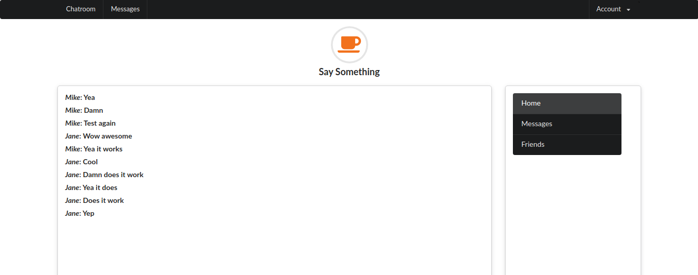
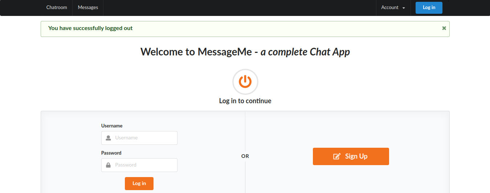

# MessageMe App

A messaging web app built with Ruby on Rails and has Real Time messgaing implemented using Action cable.

## Screenshots for login and Chatroom pages
 

  &nbsp; 

 

## Author

👤 **Osong Agberndifor**

- Github: [Osong Agberndifor](https://github.com/OA7)
- Twitter: [Osong Agberndifor](https://twitter.com/Osong17)
- Linkedin: [Osong Agberndifor](https://linkedin.com/osong-agberndifor)

## 🤝 Contributing

Contributions, issues and feature requests are welcome!

Feel free to check the [Issues page](https://github.com/OA7/Message-App/issues).
